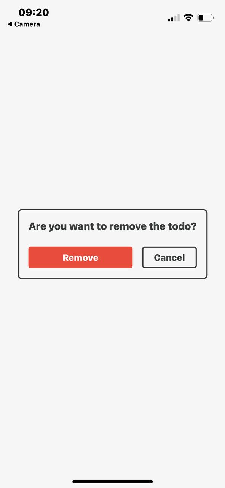
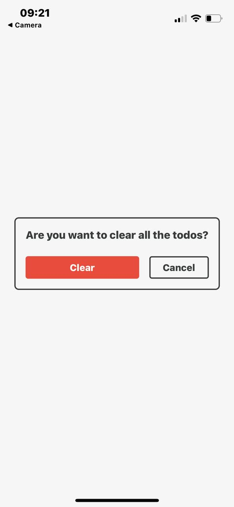
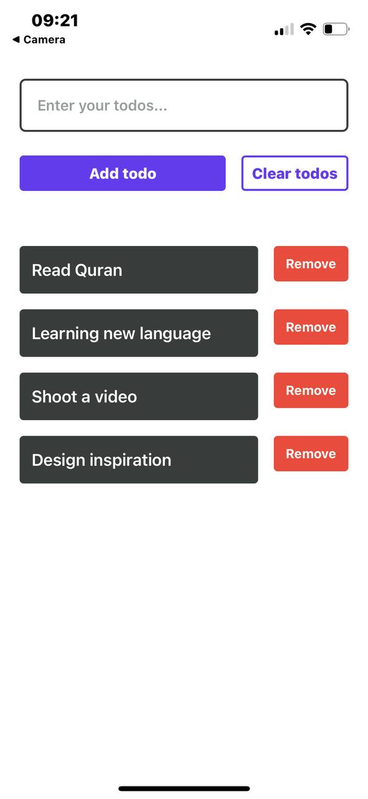

# 📱 React Native Todo List App

## Intro
A simple React Native app built with **TypeScript** that lets you manage a basic todo list, add tasks, remove tasks, clear all tasks, and get confirmation modals when deleting or clearing.

This project was my first dive into React Native, focusing on understanding the core components, handling component-specific logic, and working with platform-specific styling.

## 🚀 Tech Stack
- React Native (with expo)
- Typescript
- Pure CSS (using React Native’s StyleSheet)

## ✨ Features
- ✅ Add new todos
- ✅ Remove individual todos
- ✅ Clear all todos
- ✅ Display confirmation modals when clearing or deleting

## 🛠️ Improvements (Future Ideas)
- Enhance the app’s styling for a more polished UI
- Add a “complete todo” action (mark as done)
- Implement sorting options (e.g., by date, alphabetically)

## 📚 Learnings
- React Native core components are strict; each must handle its own logic.
- `<View>` uses Flexbox by default.
- Styles use only % or number (px), no cascading.
- Core components have cross-platform or platform-specific props.
- Learned key components: View, Text, TextInput, Button, ScrollView, FlatList, Pressable, Modal.

## 📷 Screenshots

    
    
    

